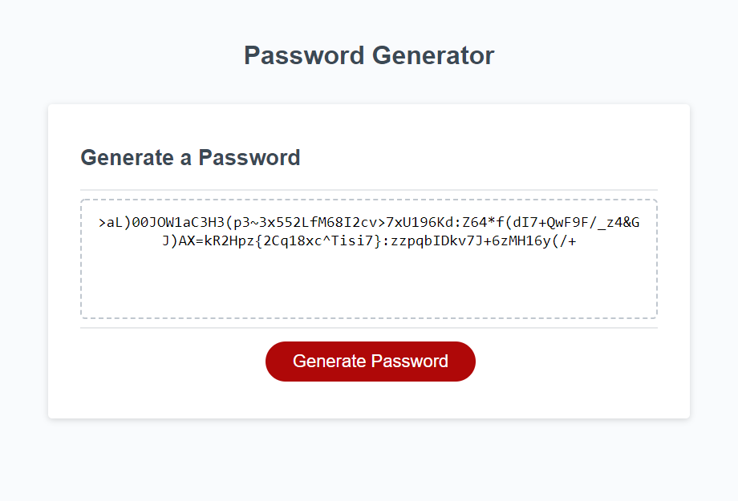

# Password Generator

Provided with an HTML and a CSS file, I developed a secure password generator using Javascript.  When the user clicks the button on the page, prompts and confirm messages appear to determine password requirements such as password length and character type.  The input is validated to ensure the requirments of at least one character type and a length of 8-128 characters are met.  Once the prompts are answered, a randomly generated password that fits the criteria is displayed on the page as seen below.

The page has been deployed at [kellyjohnson364.github.io/password-generator](https://kellyjohnson364.github.io/password-generator/)
Email: KJ3641402@gmail.com
Linkedin: [linkedin.com/in/KellyJohnson364](https://www.linkedin.com/in/kelly-johnson-473227202)
